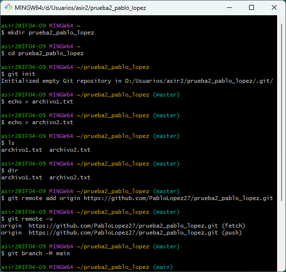
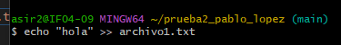
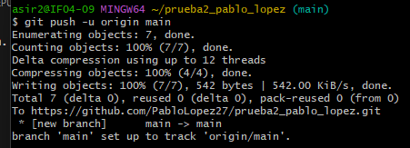
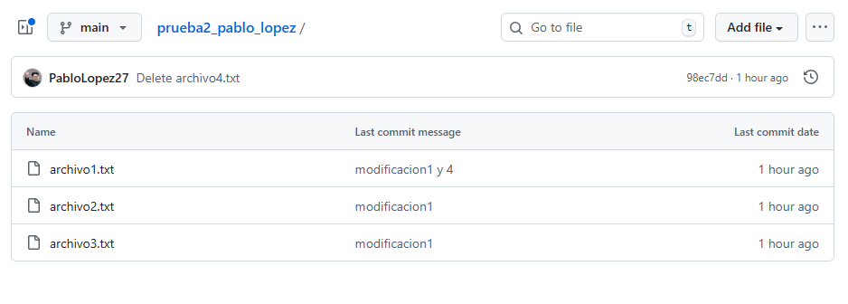

# Ejercicio1

### 1. Crear la carpeta y el repositorio local
ejecutamos los siguientes comandos

`mkdir prueba2_tu_nombre`

`cd prueba2_tu_nombre`

`git init`

### 2. Crear los archivos y agregar al respositorio

`echo > archivo1.txt`

`echo > archivo2.txt`

`git add .`

`git commit -m`

para conectar el repositorio local con el remoto ponemos el siguiente comando con la URL de nuestro repositorio

`git remote add origin https://github.com/PabloLopez27/prueba2_pablo_lopez.git`

### 3. Subir el repositorio local a GitHub

`git branch -M main`

`git push -u origin main`

### 4. Modificar archivos 

``echo "hola" >> archivo1.txt``

``echo > archivo3.txt
git add .``

``git commit -m "Modificacion1 y 4"``

``git push``

#### Algunos de los pasos que hay que seguir para hacer la practica: 

#### Debería de quedar así:

