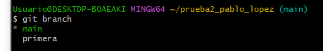

## Creamos la rama en nuestro repositorio:

## Dentro de la rama primera creamos un archivo y luego fusionamos primera con main

#### No se ha producido conflicto ya que el archivo ha sido creado en la rama “primera “y esta no existía previamente en “main”

## Para borrar la rama “primera” tenemos que salirnos de la rama y poner lo siguiente:

## Creamos la rama 2 y modificamos un archivo:

#### Vamos a la rama principal y modificamos la misma línea en el mismo fichero

#### Ahora fusionamos las 2 ramas

### Editamos el fichero y dejamos una descripción choerente y después guardamos los cambios

## Por ultimo vamos a nuestro repositorio de git y seleccionamos ramas, aquí podemos observar las ramas que tiene nuestro repositorio

