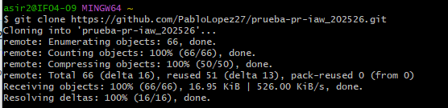
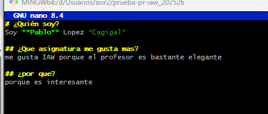
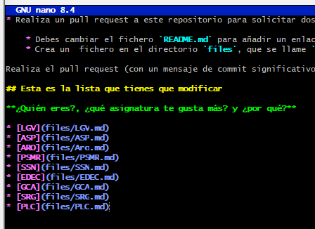
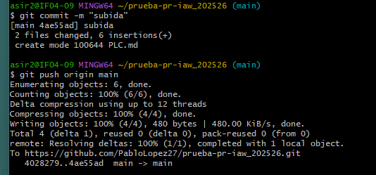
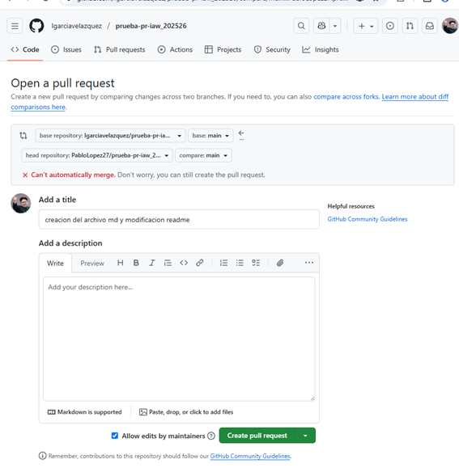
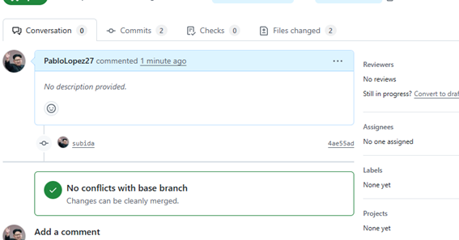

### Creamos un clon del repositorio que se crea al hacer el fork

## Creamos y añadimos el enlace del markdown al archivo readme.md 

## Hacemos el commit y subimos los cambios con gitpush

## Al acabar hacemos un pull request para unir el contenido al principal

